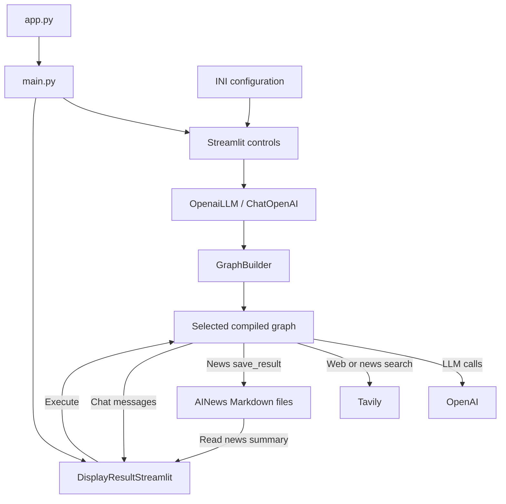
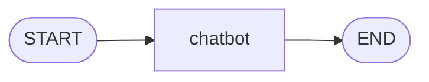
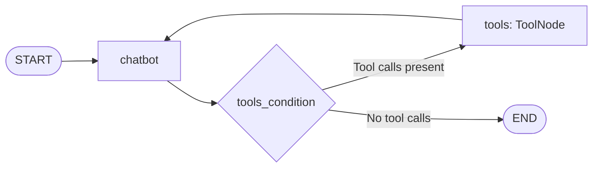
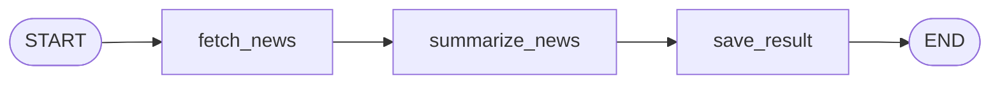

# Agentic AI Chatbot & News Summarizer

A Streamlit application that uses LangGraph to coordinate OpenAI chat responses, optional Tavily web searches, and AI news summarization. Explore three workflows: a basic chatbot, a chatbot that can call a search tool, and an on-demand news summarizer for daily, weekly, or monthly coverage.

## Features

- **Basic Chatbot:** Submit a message and receive an LLM-generated response.
- **Chatbot with Web:** Let the model decide when to search the web, execute the search through a LangGraph tool node, and use the results in its response. Tool results are also displayed in the UI.
- **AI News:** Fetch AI technology news about Pakistan and the wider world, then generate a Markdown summary with dates and source links.
- **Daily, weekly, and monthly options:** Select a news search window from the sidebar.
- **Local news output:** Save summaries in `AINews/` and render them in Streamlit.
- **Configurable UI:** Load provider labels, model choices, use cases, and the page title from an INI file.

The implemented LLM integration is OpenAI. Although the provider dropdown also lists `Groq`, no Groq integration is implemented. Chat submissions run independently; conversation history is not retained across submissions.

## Tech Stack

| Technology | Role |
| --- | --- |
| Python | Application code |
| Streamlit | Web UI, sidebar controls, chat rendering, and news display |
| LangGraph | State graphs, conditional routing, and tool execution |
| LangChain Core / Community | Messages, prompt templates, and the Tavily search tool wrapper |
| `langchain_openai` | OpenAI chat model integration through `ChatOpenAI` |
| `tavily-python` | Direct news searches through `TavilyClient` |
| Markdown | Saved news summaries |

Dependencies are listed in `requirements.txt` without version pins. It also includes `faiss-cpu`, but the application does not implement a vector index or retrieval workflow.

## Project Architecture

`app.py` calls the application loader in `main.py`. The loader reads the Streamlit controls, initializes `ChatOpenAI`, builds the selected graph, and delegates execution and display to `DisplayResultStreamlit`.



The web chatbot uses a LangChain search tool wrapped in `ToolNode`. The news workflow calls the Tavily client directly, then calls the LLM and writes a file. It does not use a tool node.

## LangGraph Workflow

### Graph state

All three graphs use `State` from `state/state.py`. Its only declared field is `messages`, annotated with LangGraph's `add_messages` reducer to merge message updates during execution.

The news nodes additionally maintain an instance dictionary, `AINewsNode.state`, containing `frequency`, `news_data`, `summary`, and `filename`. These are not declared fields in the shared graph schema. Later news nodes read that instance dictionary, and the UI reads the saved file rather than a summary from the graph's return value.

Graphs are compiled without a checkpointer and rebuilt for each submitted request. The message reducer supports the tool conversation within a run; it does not provide persistent chat memory here.

### Basic Chatbot



The `chatbot` node calls `BasicChatbotNode.process`, which invokes the LLM with `state["messages"]` and returns its response under `messages`. The UI consumes graph events with `graph.stream()` and displays the user message and assistant response. This is graph-event streaming, not token-by-token response rendering.

### Chatbot with Web



1. `get_tools()` creates `TavilySearchResults(max_results=2)`.
2. `ChatbotWithToolNode.create_chatbot()` binds that tool to the LLM using `bind_tools()`.
3. The `chatbot` node invokes the tool-enabled model with the current messages.
4. `tools_condition` routes tool calls to the `tools` node, or ends the graph when no tool call is present.
5. `ToolNode` executes the search and adds tool results to the messages. The graph returns to `chatbot` so the model can respond or request another tool call.
6. The UI uses `graph.invoke()` and renders human messages, tool results, and nonempty assistant responses.

The graph uses the callable returned by `create_chatbot()`; the separate `process()` method containing simulated tool text is not wired into this workflow.

### AI News



- **`fetch_news`:** Reads the requested frequency from the first message, maps it to Tavily search parameters, and stores the returned articles.
- **`summarize_news`:** Formats article content, URLs, and publication dates into a prompt and invokes the LLM once to generate a Markdown summary.
- **`save_result`:** Writes a heading and the summary to `AINews/{frequency}_summary.md`. This is the result node; there is no separate node named `result`.

The edges are sequential, with no conditional routing. After `graph.invoke()` completes, the UI opens the corresponding Markdown file and displays its contents.

## Project Structure

```text
agentic-chatbot/
├── app.py                          # Streamlit entry point
├── requirements.txt                # Python dependencies
├── README.md
├── AINews/                         # Saved news summaries
│   ├── daily_summary.md
│   ├── weekly_summary.md
│   └── monthly_summary.md
└── src/
    ├── __init__.py
    └── langgraphagenticai/
        ├── main.py                 # UI, model, graph, and display orchestration
        ├── LLMS/
        │   └── openaillm.py        # ChatOpenAI initialization
        ├── graph/
        │   └── graph_builder.py    # Builds and compiles the three workflows
        ├── nodes/
        │   ├── basic_chatbot_node.py
        │   ├── chatbot_with_tool_node.py
        │   └── ai_news_node.py     # Fetch, summarize, and save news
        ├── state/
        │   └── state.py            # Shared messages state
        ├── tools/
        │   └── search_tool.py      # Tavily search tool and ToolNode factory
        └── ui/
            ├── uiconfigfile.ini    # Page title, providers, models, and use cases
            ├── uiconfigfile.py     # INI configuration reader
            └── streamlitui/
                ├── loadui.py      # Sidebar controls and news fetch button
                └── display_result.py
```

Additional empty package `__init__.py` files are omitted for readability.

## Installation

You need Python with `pip`, an OpenAI API key, and a Tavily API key for either search-based use case. The repository does not specify a Python version or lock dependency versions.

1. Clone or download this repository and open a terminal in its root directory.
2. Create a virtual environment:

   ```bash
   python -m venv .venv
   ```

3. Activate it using the command for your shell.

   **Windows PowerShell:**

   ```powershell
   .\.venv\Scripts\Activate.ps1
   ```

   **macOS / Linux:**

   ```bash
   source .venv/bin/activate
   ```

4. Install the dependencies:

   ```bash
   python -m pip install -r requirements.txt
   ```

## Environment Variables

The application uses the following API key names, but its current setup expects keys to be entered in the Streamlit sidebar:

| Key | Required for | Current handling |
| --- | --- | --- |
| `OPENAI_API_KEY` | All three use cases | The sidebar value is passed directly to `ChatOpenAI`. |
| `TAVILY_API_KEY` | Chatbot with Web and AI News | The sidebar value is assigned to `os.environ["TAVILY_API_KEY"]` for the search clients. |

Placeholder values only:

```dotenv
OPENAI_API_KEY=your_openai_api_key
TAVILY_API_KEY=your_tavily_api_key
```

The application does not load `.env` files. Setting environment variables alone is not a replacement for filling in the sidebar: the Tavily field overwrites its environment variable, and the OpenAI wrapper passes the sidebar value explicitly. Its empty-key check also reads `os.environ["OPENAI_API_KEY"]`, which can raise an error when that variable is absent. Enter both applicable keys before submitting a request.

## Running the Application

Run this command from the repository root with the virtual environment active:

```bash
python -m streamlit run app.py
```

Open the local URL printed by Streamlit. In the sidebar:

1. Select **Openai** as the LLM provider.
2. Select a model and enter your OpenAI API key.
3. Select **Basic Chatbot**, **Chatbot with Web**, or **AI News**.
4. For web chat or news, enter your Tavily API key.
5. Send a chat message, or select a news time frame and click **Fetch Latest AI News**.

Model choices come directly from `src/langgraphagenticai/ui/uiconfigfile.ini`: `gpt-5.6-luna`, `gpt-5.4-nano`, and `gpt-6-luna`. These are configured identifiers, not a guarantee of API availability. The code passes the selected value unchanged to `ChatOpenAI`, with no availability check or fallback; configure a model available to your account if necessary.

Running from the root matters because both the INI configuration and `AINews/` output use relative paths. Keep the existing `AINews/` directory in place; the save node does not create it.

## How It Works

1. Streamlit loads the page and sidebar options from the INI configuration.
2. A chat submission or news fetch supplies the input for the selected workflow.
3. The application initializes the OpenAI model using the sidebar key and model selection.
4. `GraphBuilder` creates and compiles the appropriate graph.
5. The graph calls the LLM, executes any requested web search, or runs the news pipeline.
6. The display layer renders chat messages and tool output, or reads and displays the saved news summary.

## AI News Summarizer

News generation is **on demand**. Daily, weekly, and monthly refer to search windows; there is no scheduled background fetch.

| UI option | Tavily `time_range` | Tavily `days` | Output file |
| --- | --- | --- | --- |
| Daily | `d` | `1` | `AINews/daily_summary.md` |
| Weekly | `w` | `7` | `AINews/weekly_summary.md` |
| Monthly | `m` | `30` | `AINews/monthly_summary.md` |

For each request, the fetch node uses the fixed query `Top Artificial Intelligence (AI) technology news Pakistan and globally`, with `topic="news"`, `include_answer="advanced"`, and `max_results=20`. It consumes the response's `results` list, not its generated answer. The source also contains a `year` mapping, but the sidebar exposes only the three options above.

The summarization prompt includes each result's `content`, `url`, and `published_date`. It asks the LLM for concise Markdown entries, dates in `YYYY-MM-DD` format in IST, newest-first ordering, and source links. Date conversion, ordering, and output formatting are requested through the prompt; they are not enforced by Python validation or sorting.

The save node writes `# Daily AI News Summary` (or the corresponding frequency) followed by the generated text. Each request overwrites that frequency's existing file. The repository includes saved summaries, and new requests replace them. The UI then renders the file as Markdown.

## Screenshots

_Screenshots to be added: Basic Chatbot, Chatbot with Web showing tool results, and AI News with a generated summary._

## Future Improvements

The following are proposed improvements, not existing features:

- Add persistent conversation history and LangGraph checkpointing for multi-turn chat.
- Define explicit news state fields in the graph schema instead of passing intermediate data through an instance dictionary.
- Unify API key loading and validation, validate model choices, and implement or remove the unused Groq option.
- Handle empty search results and API failures explicitly, validate summary dates and links, and create the output directory when missing.
- Pin dependency versions and add automated tests for graph routing and news processing.

## Contributing

1. Fork the repository and create a branch for your change.
2. Keep changes focused and update documentation when behavior changes.
3. Run the application and manually check the affected workflows. No automated test suite is currently included.
4. Open a pull request describing the change and how you verified it.

Keep API keys and other credentials out of commits.

## License

No license has been specified yet; the repository does not contain a license file.
